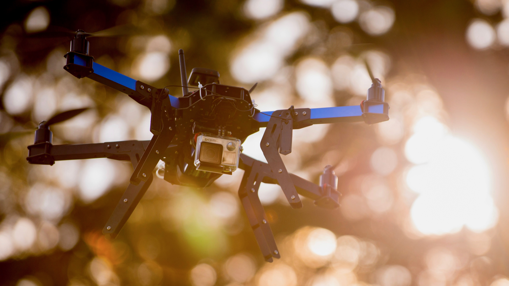
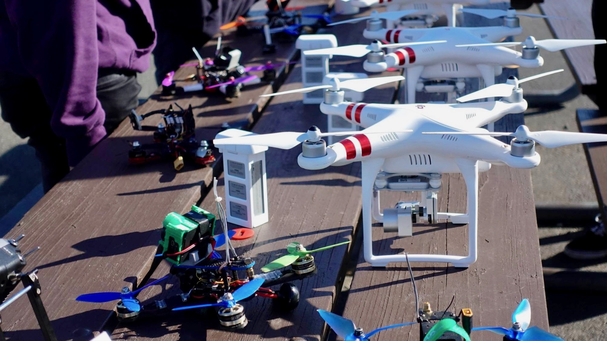

<header>

</header>

We are a student organization dedicated to providing a central resource for unmanned aerial vehicle development and flight at UC Berkeley. We produce novel vehicles, advanced software, aerial photography and video content, and even race our drones.

<section class="icon_grid">
	<article>
		
			
		
		<h3>Engineering Projects</h3>
		
Design, code, and build novel projects in aerial robotics.

	</article>
	<article>
		
			
		
		<h3>Drone Racing</h3>
		
Pilot acrobatic FPV racing quadcopters up to 100mph in competitive collegiate events.

	</article>
	<article>
		
			
		
		<h3>Video/Photo</h3>
		
Fly videography drones to capture scenes from the skies and produce video edits.

	</article>
	<article>
		
			
		
		<h3>Build Days</h3>
		
Go from parts to a flying machine in a matter of hours with some help from our members.

	</article>
	<article>
		
			
		
		<h3>Fly Days</h3>
		
Learn to fly a drone with our hardware and some help from our members.

	</article>
	<article>
		
			
		
		<h3>Milestones</h3>
		
All our project teams share their progress and communicate what they've learned.

	</article>
</section>

 

## About
By providing a resource-rich organization for UC Berkeley students interested in designing, building, and flying UAVs, we hope to encourage collaboration across multiple engineering disciplines. Students will step out of their comfort zone and learn new skills by working on project teams with other majors. To view some of the work we've done in the past, check out our projects:

<a href="{{ site.url }}{{ site.baseurl }}/projects.html" class="button">Projects</a>

Aside from a range of aerial videography projects, academic research projects, and racing competitions, our club has a strong infrastructure for educating our campus and the public about drones and their applications. We host Fly Days, Build Days, and symposium style "Milestone" events to give campus affiliates an understanding of drones today, and how they'll be important in the future. Above all, UAVs@Berkeley seeks to bring the capabilities and potential of unmanned aerial vehicles to the minds and hands of students at Cal.

## History
Founded in the Fall of 2015, as the consumer drone market started to gain momentum, UAVs@Berkeley came out of a need for UC Berkeley engineers to collaborate on this newly accessible technology. Off to a quick start, the new organization's leaders focused on rapid recruitment and hosting publically accessible events. A generous hardware donation from Berkeley drone company 3D Robotics allowed the club to start building custom quadcopters in its first semester. UAVs@Berkeley enjoyed a strong interest from the student body and attendance at our early Build Days and Fly Days steadily increased.

By the Spring of 2017, the club had grown to 60-80 active members each semester and our project teams were founded. Each team focuses on unique aspects of drone technology, allowing members to specialize based on their interests. Our CALFPV racing team had gone competitive, attending local and out-of-state races to represent Cal. Sponsorship oppurtunities came our way as the club gained membership and attempted more and more ambitious projects. The Berkeley Institute of Transportation Studies kindly offered us a lab on campus which kickstarted our hardware acquisition and prototyping capabilities.

Now the club has the talent, resources, and knowledge base to consistently push the state of the art in drones. Come join us, and you’ll see why the movement is contagious – it’s about building, flying, and collaborating.

