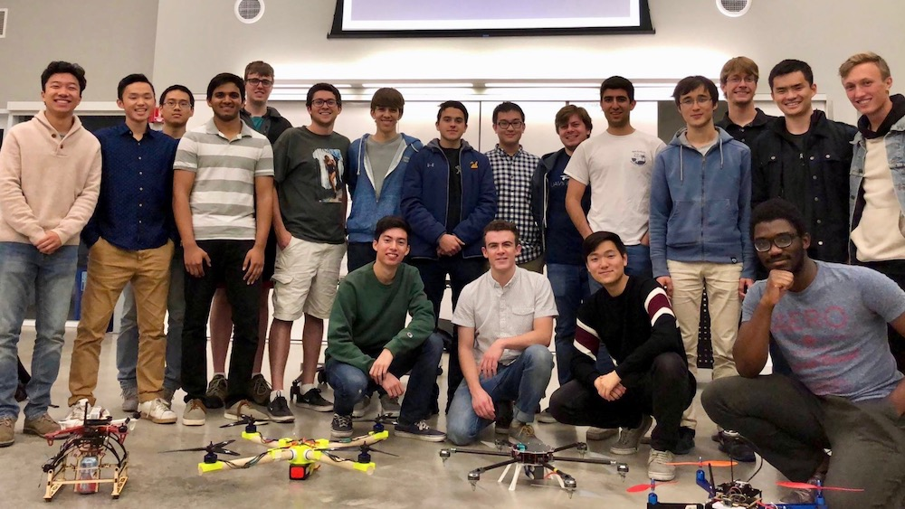
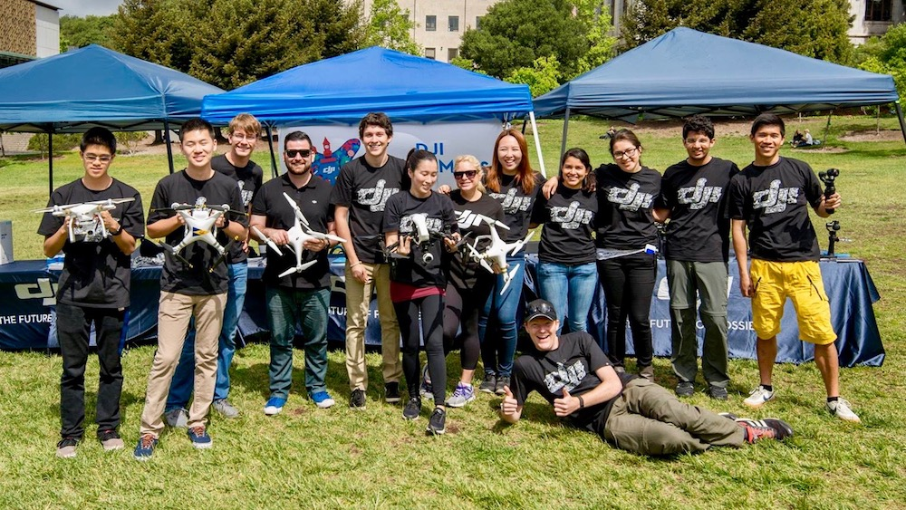
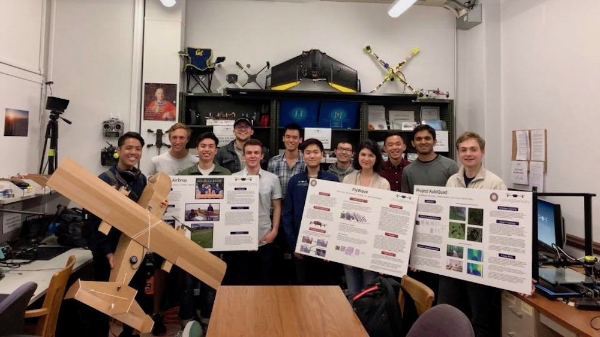

All majors are welcome at UAVs@Berkeley and everyone can bring something unique and valuable to the table. You can join at any time during the semester but most people join teams at the beginnning of each semester during our recruitment process. No experience is necessary as long as you've got a passion unmanned flight and the time to dedicate to our efforts. If you're looking to become an active member of the club, the most important thing to do is to join our Slack channels where all club communication takes place. The link to join is below:

<a target="_blank" href="https://join.slack.com/t/uavsatberkeley/signup" class="button">Slack Signup</a>

In order to fly drones with us, you've got to take care of a couple tasks:
1. Attend a UAVs@Berkeley flight safety training, where we'll walk you through how to be safe and legal when you fly a drone. These take place 3 or 4 times throughout a semester. Checkout our <a href="{{ site.url }}{{ site.baseurl }}/calendar.html">calendar</a> to find out when the next one is and RSVP on the <a target="_blank" href="https://www.facebook.com/pg/UAVsAtBerkeley/events/">Facebook event</a>.
2. At flight safety training, sign up for an <a target="_blank" href="http://www.modelaircraft.org/">AMA</a> insurance card, this costs $20. This protects our students and our club against damages.
3. Retrieve your AMA card from our <a href="{{ site.url }}{{ site.baseurl }}/contact.html">lab</a>, and come out to a fly day.

To join one of our teams, attend our General Meeting in the beginning of the semester. If that event has already come and gone, reach out to the project manager on Slack to see where they can fit you in.

