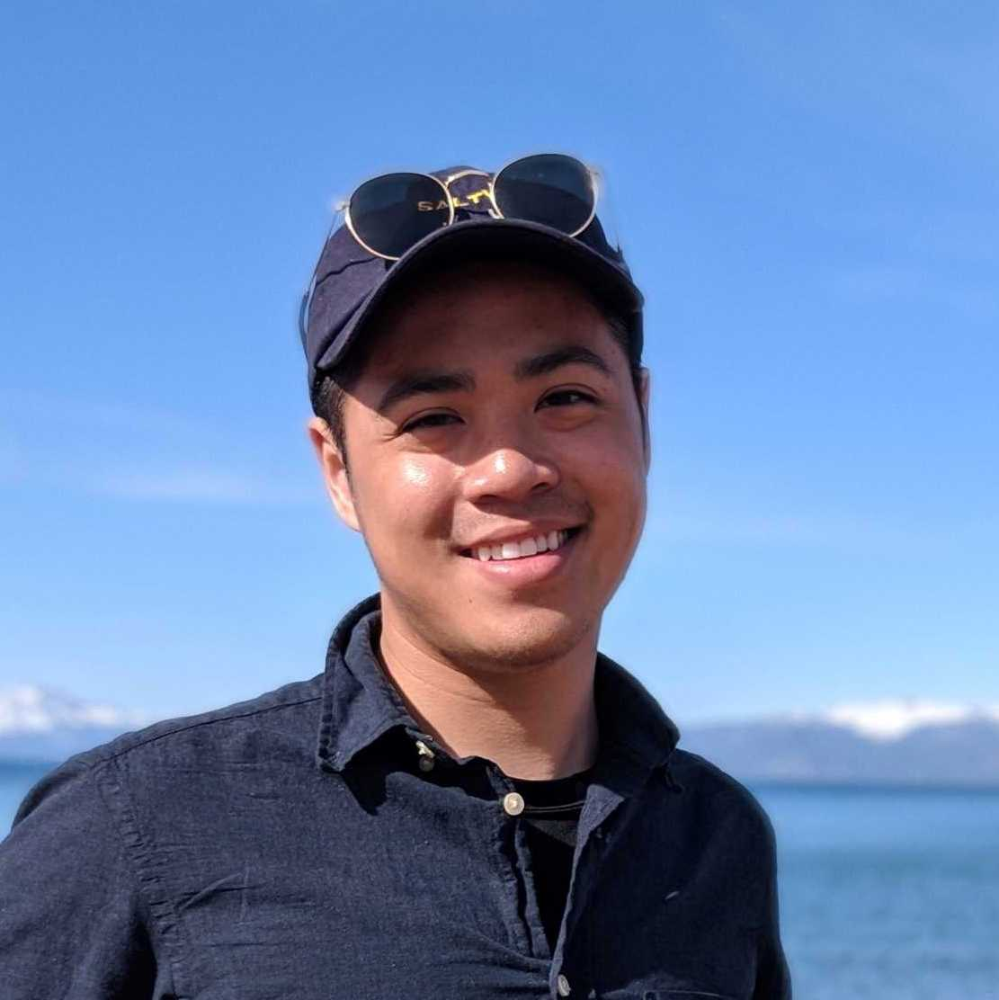
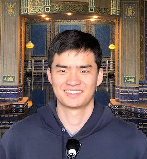

The leadership at UAVs@Berkeley manages our projects, coordinates club sponsorship and funding, communicates with UC Berkeley administration, plans events, and more. Each member of the team dedicates hundreds of hours each semester to making UAVs@Berkeley what it is. 

## Executive Board

<section class="people">
	<article>
		
			
		
		<h3>Matt Wong</h3>
		
President | Data Science C'20

	</article>
	<article>
		
			
		
		<h3>Ryan Park</h3>
		
Vice President | Economics C'20

	</article>
</section>

 

## Officers

<section class="people">
	<article>
		
			
		
		<h3><a href="https://minospark.com/" style="inherit">Minos Park</a></h3>
		
Technical Officer | Computer Science C'19

	</article>
	<article>
		
			
		
		<h3>Adam Saleh</h3>
		
Outreach Officer | Cognitive Science C'22 Sustainable Design Minor

	</article>
</section>

 

## Project Managers

<section class="people">
	<article>
		
			
		
		<h3>Nick Doerschlag</h3>
		
Video/Photo Team Manager | Architecture C'20

	</article>
	<article>
		
			
		
		<h3>Darius Dastur</h3>
		
AUVSI Competition Project Manager | Mechanical Engineering C'20

	</article>
	<article>
		
			
		
		<h3>Timothy Liu</h3>
		
CS C'20

	</article>	
</section>

 

## Leadership Alumni

<a href="{{ 'alumni.html' | relative_url }}" class="button">Alumni</a>

