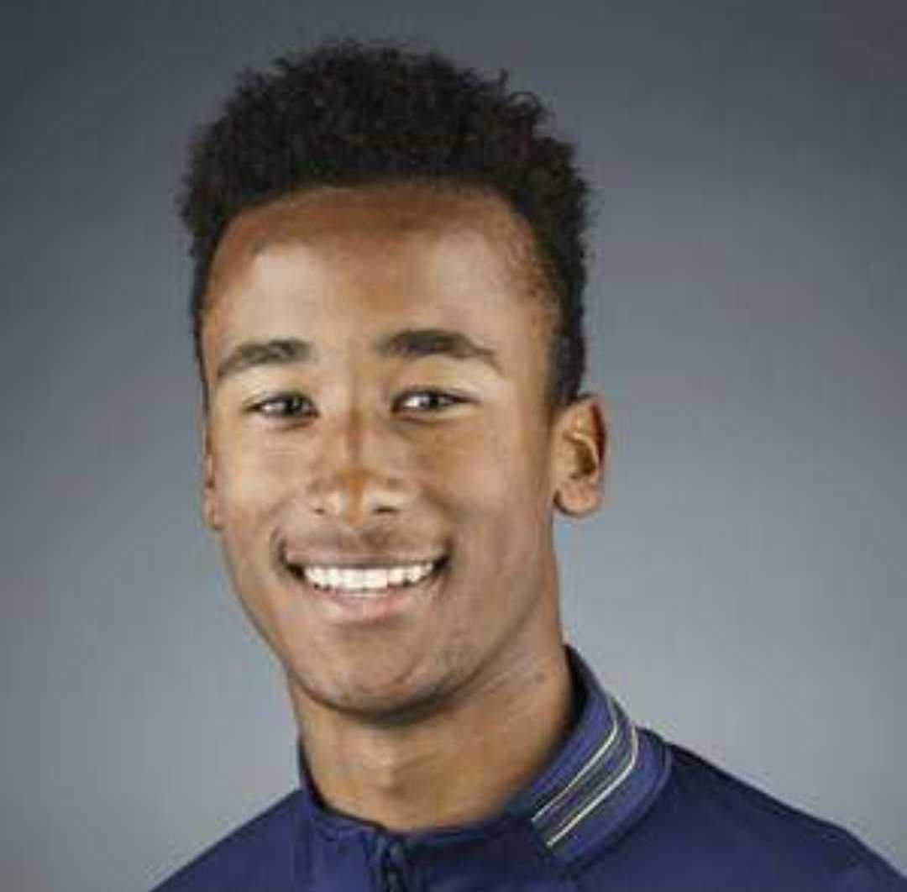
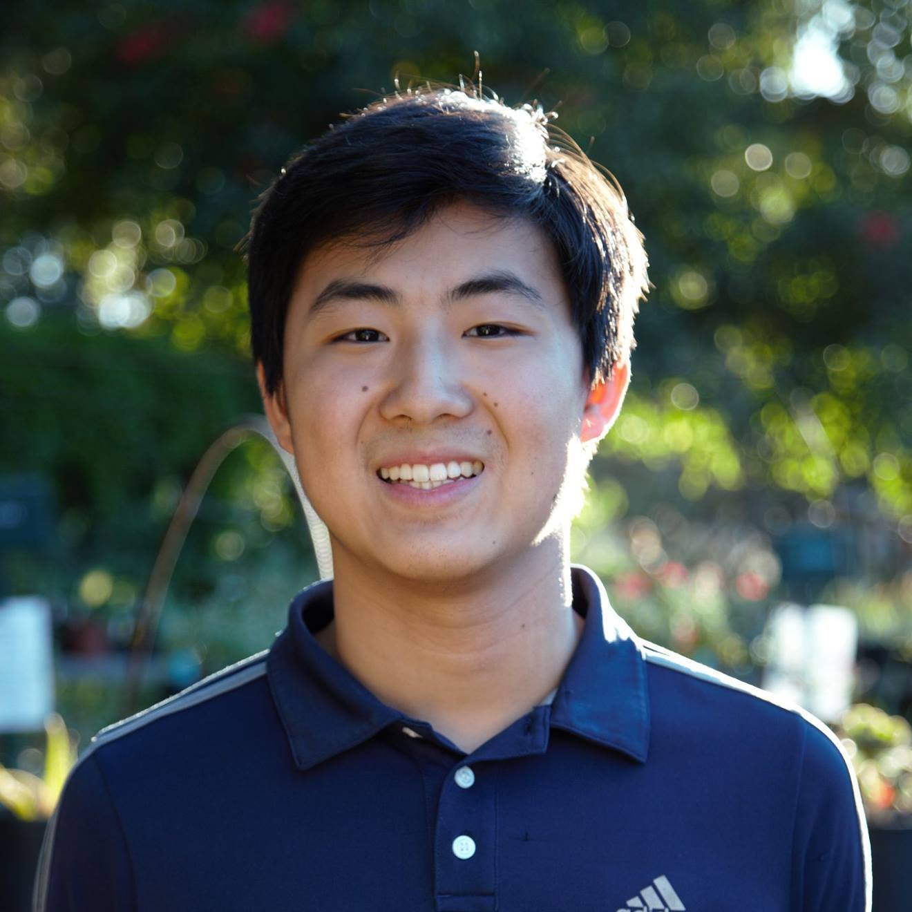
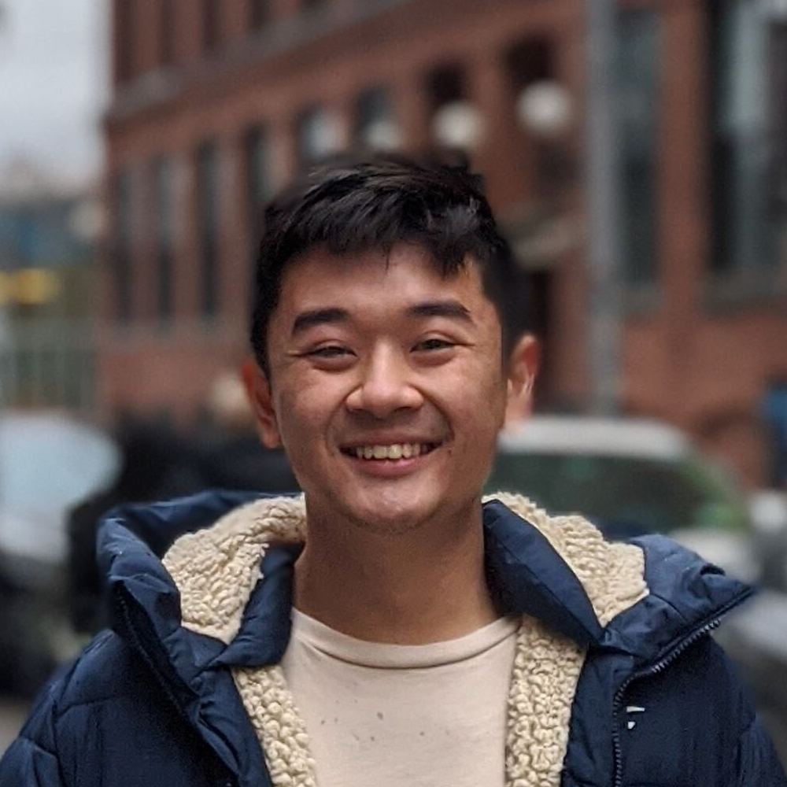

The leadership at UAVs@Berkeley manages our projects, coordinates club sponsorship and funding, communicates with UC Berkeley administration, plans events, and more. Each member of the team dedicates hundreds of hours each semester to making UAVs@Berkeley what it is. 

## Executive Board

<section class="people">
	<article>
		
			
		
		<h3>Adam Saleh</h3>
		
President | Cognitive Science C'22 Sustainable Design Minor

	</article>
	<article>
		
			
		
		<h3>Calvin Yan</h3>
		
Vice President   AeroBear SW Team Manager |   Computer Science C'23

	</article>
</section>
 

## Officers

<section class="people">
	<article>
		
			
		
		<h3><a href="https://minospark.com/" style="inherit">Minos Park</a></h3>
		
Technical Officer | Computer Science C'20

	</article>
</section>

 

## Project Managers

<section class="people">
	<article>
		
			
		
		<h3>Jonathan Pan</h3>
		
AeroBear AutoNav Team Manager | Computer Science & Data Science C'21

	</article>
</section>

 

## Leadership Alumni

<a href="{{ 'alumni.html' | relative_url }}" class="button">Alumni</a>

