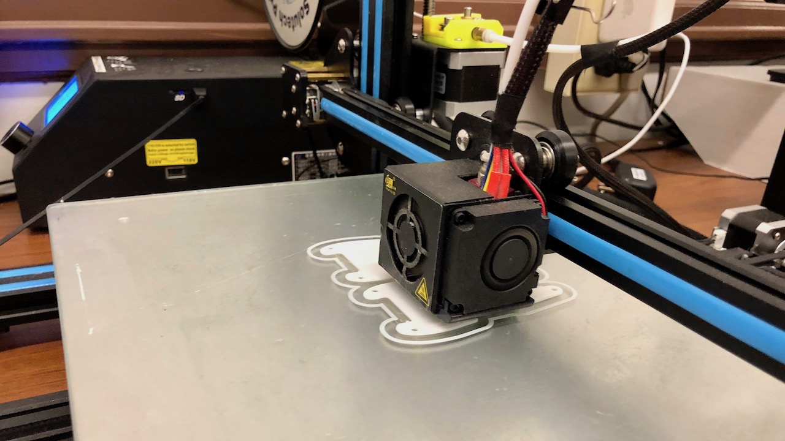
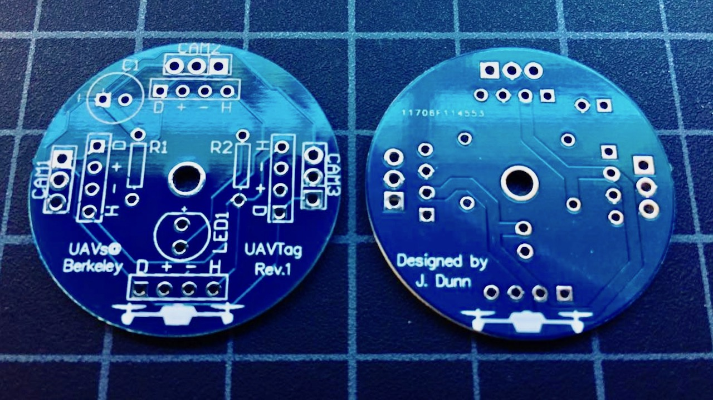
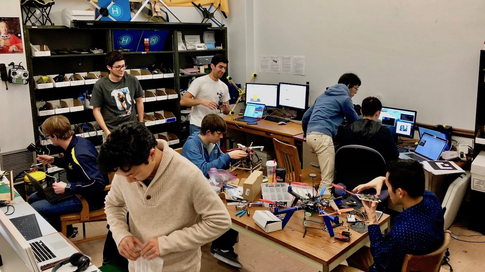
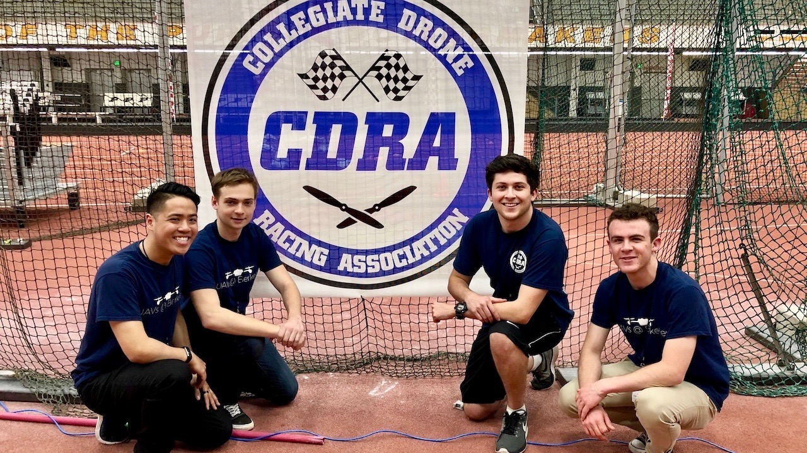
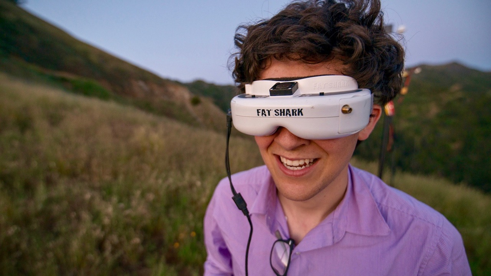
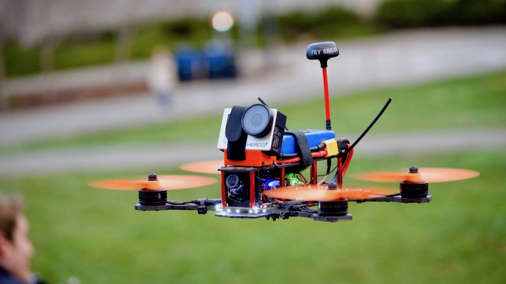
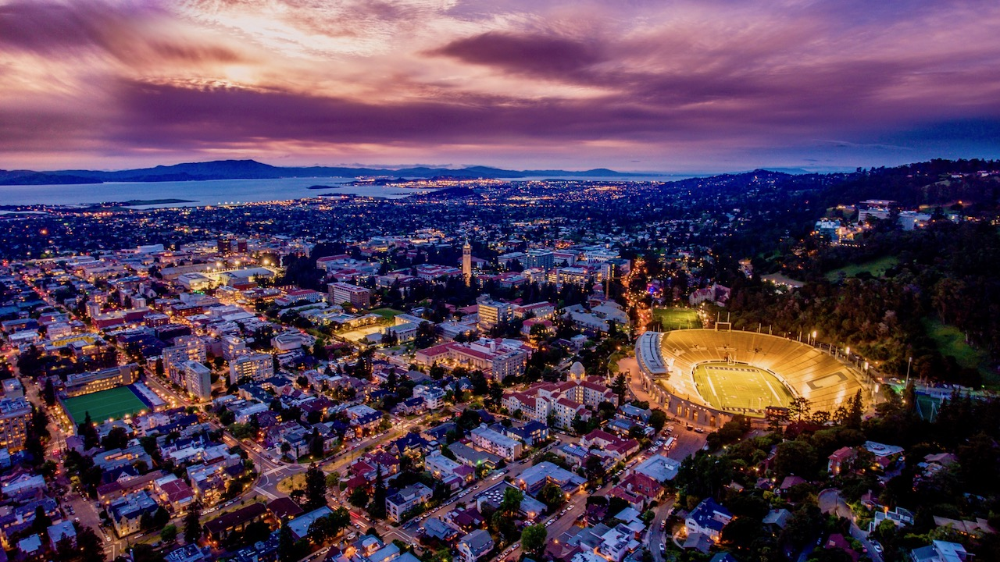
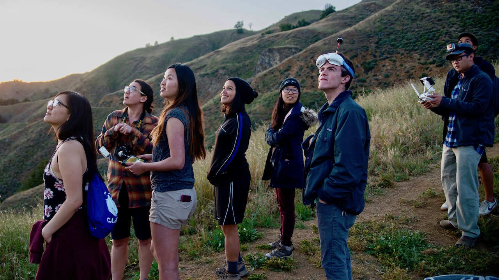
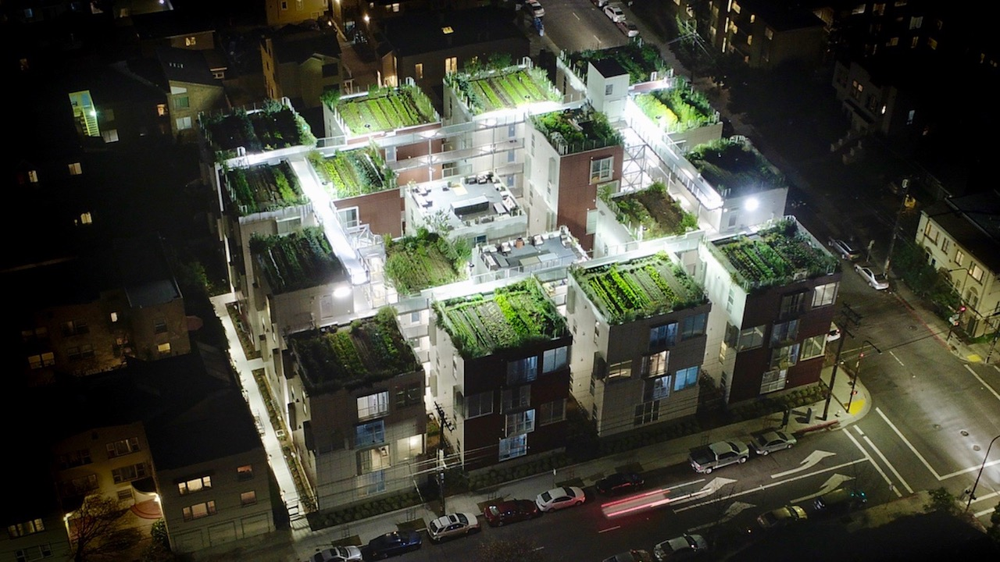

## Engineering Project Teams
Our engineering projects teams design, build, and test novel advances in aerial robotics every semester. Projects last for one semester and are lead by experienced members of the club. Projects are announced by their managers at the start of each semester's recruitment phase, then teams of 5-10 students are grouped based on interest to start coding, CADing, and fabricating. We host milestone events throughout the semester for these teams to share what they've learned and run demos of their new tech. Not only do these projects allow students to apply what they've learned in their engineering coursework to a real product, but they make our members more effective teammates in a fast-paced, technical research environment. For a look at what some of our past projects have accomplished, check out the <a href="projects.html">projects</a> page.

	

		<iframe width="560" height="315" src="https://www.youtube.com/embed/6JyJ0izAp9o?rel=0" frameborder="0" allow="autoplay; encrypted-media" allowfullscreen></iframe>
	

## CALFPV Drone Racing Team
<a href="https://en.wikipedia.org/wiki/First-person_view_(radio_control)" target="_blank">FPV</a> (First Person View) drone racing is an adrenaline rush like no other. We design, build, and pilot high-powered quadcopters capabale of flying up to 100mph through video goggles giving us a live view of what the aircraft sees. We set up airgates and pylons and race a course, or fly acrobatic freestyle in unique locations. The CALFPV team competes on a national level with other university FPV racing teams and travels to Purdue Univerity for the <a href="http://collegiatedroneracingassociation.com/" target="_blank">Collegiate Drone Racing National Championship</a> each year.

	

		<iframe width="560" height="315" src="https://www.youtube.com/embed/yNwtpRoZegY?rel=0" frameborder="0" allow="autoplay; encrypted-media" allowfullscreen></iframe>
	

## Videography/Photography Team
The videography and photography team focuses on capturing scenes from the skies. The team takes trips to destinations and events throughout the bay area to capture content. Each member learns professional video and photo editing software culiminating in a finished video project at the end of the semester. The team also shoots drone footage for other clubs and teams like the video below featuring <a href="http://caltriathlon.com/" target="_blank">Cal Triathalon</a>. For more content from the video/photo team, check out our <a target="_blank" href="{{ site.youtube }}">YouTube</a> channel and <a target="_blank" href="{{ site.instagram }}">Instagram</a>.

	

		<iframe width="560" height="315" src="https://www.youtube.com/embed/2y4W0xuZ9E4?rel=0" frameborder="0" allow="autoplay; encrypted-media" allowfullscreen></iframe>
	

